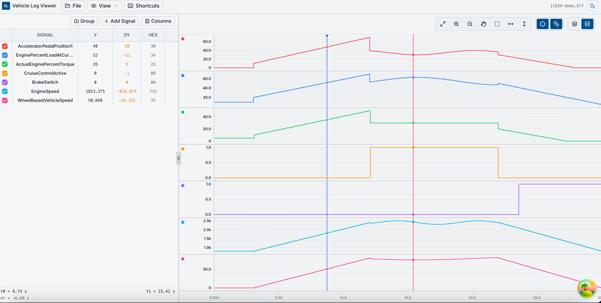
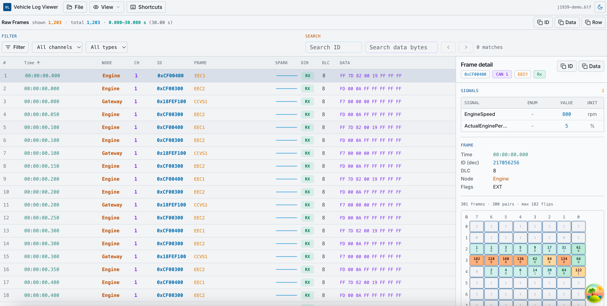
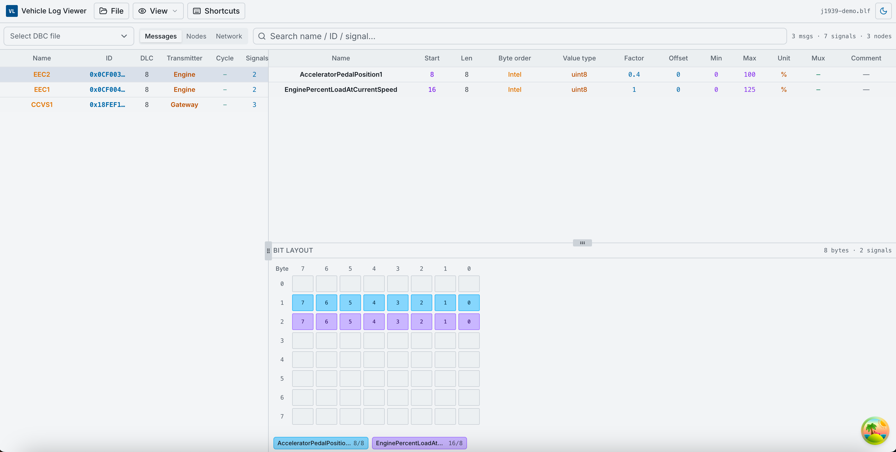

# Vehicle Log Viewer

<p align="center">
  
</p>

<p align="center">
  Open-source, browser-based CAN log analyzer.<br/>
  Load BLF / ASC / CSV / MF4 and DBC, decode in the browser, then explore on <strong>Graph</strong>, <strong>Trace</strong>, or <strong>DBC</strong>.
</p>

<p align="center">
  <a href="https://wanderzil.github.io/vehicle-log-viewer/"><strong>Live demo</strong></a>
  ·
  <a href="./docs/guide.md">User guide</a>
  ·
  <a href="./docs/architecture.md">Architecture</a>
</p>

<p align="center">
  <strong>Community edition</strong> — fully client-side, no login, no server upload.
</p>

---

## Screenshots

> Screenshots live under [`docs/samples/`](./docs/samples/) (`graph.png`, `Trace.png`, `DBC.png`).

| Graph | Trace | DBC |
|:-----:|:-----:|:---:|
|  |  |  |
| Signal charts, cursors, groups | Frame table, decode, bit heatmap | Messages, bit layout, attributes |

---

## Features

- **Graph** — time-series charts, signal search, zoom/pan, main & diff cursors, project save/load
- **Trace** — searchable CAN frame table, filters, decoded detail panel, bit activity heatmap
- **DBC** — browse messages, signals, nodes, enums, and bit layout without a log file
- **Formats** — BLF, ASC, CSV, MF4 (client-side parsing)
- **Export** — CSV export for loaded or all parsed signals
- **Project files** — save and restore workspace layout (`.blfproject.json`)
- **i18n** — English and Chinese UI

---

## Architecture

Vehicle Log Viewer is a **static client-side application**:

- **UI layer** — React 19 + TanStack Router + TanStack Query
- **Parsing layer** — browser-side BLF / ASC / CSV / MF4 readers in `src/lib/can/`
- **Decode layer** — DBC loading, channel mapping, signal decode, trace row annotation
- **Workspace layer** — one in-memory `ClientAnalysisSession` shared by Graph / Trace / DBC
- **Persistence layer** — `.blfproject.json` export/import for layout and mapping state

The three main views all read from the same local analysis session:

- **Graph** focuses on decoded signal time-series analysis
- **Trace** focuses on raw frame inspection plus per-row signal decode
- **DBC** focuses on browsing the database itself

Implementation details: [docs/architecture.md](./docs/architecture.md)

---

## Quick start

```bash
pnpm install
cp .env.example .env.development
pnpm dev
```

Open [http://localhost:3000](http://localhost:3000).

### Typical workflow

1. **File → Load CAN log…**
2. **File → Load DBC…**
3. **File → Channel mapping…** — assign DBC(s) to channels, then click **Start parsing** on the mapping card
4. **View → Graph** / **Trace** / **DBC**

Details: [docs/guide.md](./docs/guide.md)

### Local deployment / preview

```bash
pnpm build
pnpm preview
```

### GitHub Pages build

```bash
VITE_BASE_PATH=/your-repo-name/ pnpm build:pages
```

The app is distributed as a static SPA. No database or backend service is required for the community edition.

---

## Deploy (GitHub Pages)

Static SPA — no server or database. CI workflow: [`.github/workflows/pages.yml`](./.github/workflows/pages.yml).

1. Push to `main` (or `clean-main`)
2. Repo **Settings → Pages → Source**: GitHub Actions
3. Optional repo **Variables**: `VITE_BASE_PATH`, `VITE_APP_URL`, `VITE_COMMERCIAL_URL`

Local static build:

```bash
VITE_BASE_PATH=/your-repo-name/ pnpm build:pages
# Output: .output/public (includes 404.html SPA fallback)
```

Optional env:

| Variable | Purpose |
|----------|---------|
| `VITE_BASE_PATH` | Asset/router base (`/` or `/repo-name/`) |
| `VITE_APP_URL` | Public site URL |
| `VITE_APP_NAME` | App title |
| `VITE_COMMERCIAL_URL` | Link to hosted Pro edition (optional) |

---

## Documentation

| Doc | Description |
|-----|-------------|
| [docs/guide.md](./docs/guide.md) | Detailed Graph, Trace, DBC user guide |
| [docs/architecture.md](./docs/architecture.md) | Implementation architecture and data flow |
| [docs/screenshots/](./docs/screenshots/) | Screenshot assets for README |
| [THIRD_PARTY_NOTICES.md](./THIRD_PARTY_NOTICES.md) | Dependency licenses |

---

## License

MIT — see [LICENSE](./LICENSE).
